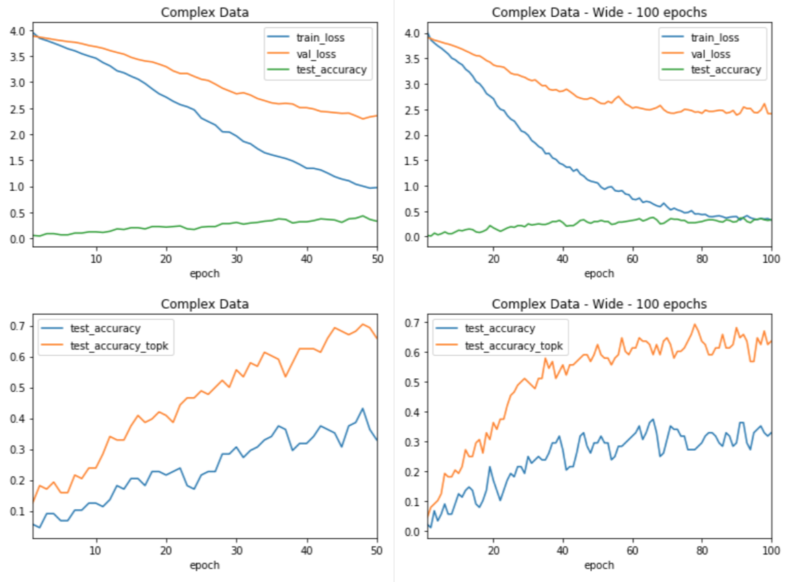
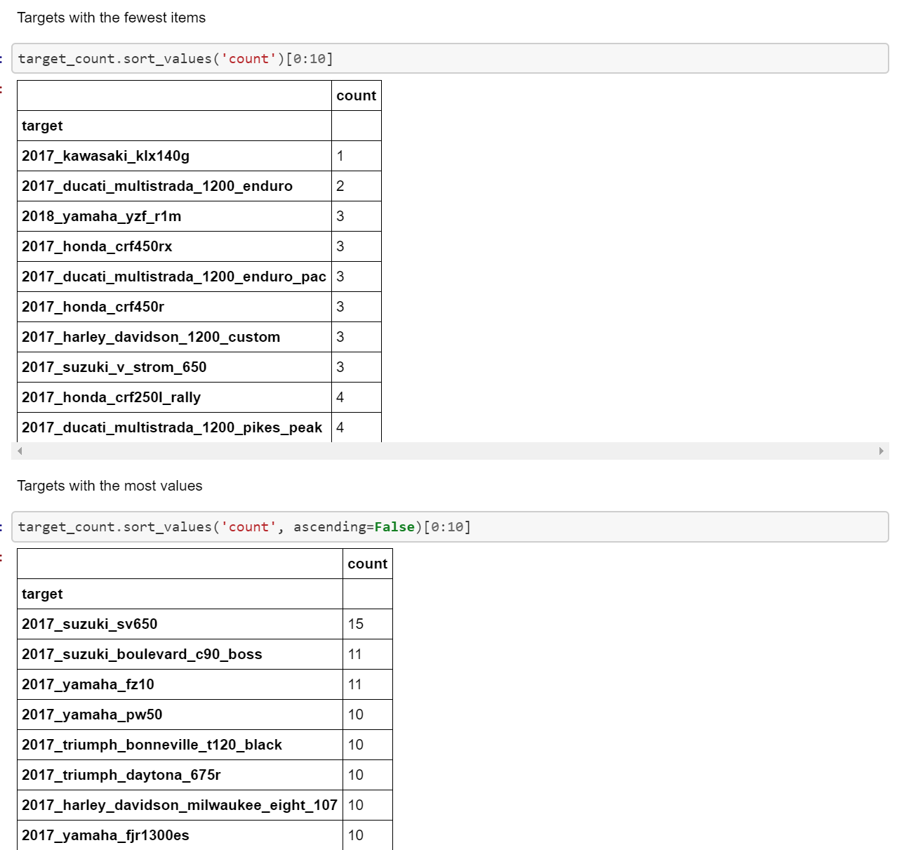
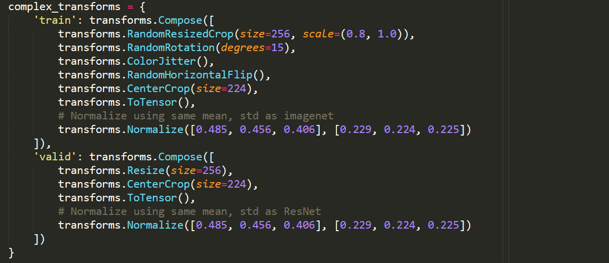

**My Data Journey with Motorcycle Classification **

Summary
=======

It always starts the same way. The forum post is accompanied by a photo
of some random motorcycle. What bike is this? Experts and novices alike
scramble to find the make, model and year of the motorcycle pictured.
Wouldn't it be nice to easily classify a motorcycle from an image? This
project seeks to do just that.

Using the power of pre-trained convolutional neural networks, we can
customize the models to classify the year, make and model of motorcycle
images. What kind of performance can we expect? Is it even possible?
Motorcycles can be very similar between various models and years. We
will find that we can routinely achieve around 70% top-3 accuracy with a
relatively small data set. We will also find that to increase accuracy,
we would likely need to greatly increase the size of the data set
collected in this project. Along the way, we will look at methods to
collect and process data, while building a suitable model for
classification.

In the end, we will find that model tuning, data transformation, and
data augmentation have, at best, incremental benefits on the model. In
fact, the best time I spent on this project involved performance tuning
Pytorch itself to achieve faster modeling times.

Throughout the last eight weeks, I conducted myriad experiments. Not all
are included in this document or code repository. Most test results show
will test data with fifty targets over fifty epochs. Some will include
more epochs as needed. Data with fifty targets was the sweet spot
between a low number of targets with high accuracy and a high number of
targets with low accuracy.

\*\* Please note. Only selected code examples are included in this
document. To see all code, look through the Jupyter notebooks and the
two python packages in the git repository. The notebooks are numbered in
order needed to run all of them. They have all ben saved with output.
This means you can see the code and results in the Github repository.

\*\* Since I do not have license to publish the data I used, data is not
included in this repository. Though, the code to obtain data is. See
notebooks 1 and 2. Notebook 2 will require a Microsoft Azure account and
an API key for their cognitive services. As with any automated image
download, issues can occur. The most common was bad images and images
with long names. These are easily resolved and script output points to
the issues.

\*\* To run the Jupyter notebooks, a little setup is required. Libraries
are listed in each of the notebooks. I recommend using Anaconda and
creating a virtual environment. Utility functions and classes are
included in randomdatautilities and modeling. The can be installed with
pip -e.

Data
====

I could not find any existing free data sets for image classification.
There were commercial options, but prices were not listed. In the end, I
decided to create my own data set. After a lot of experimentation, I
found that totalmotorcycle.com had a very consistent naming convention
for motorcycles and included just about every commercial motorcycle ever
made. This was a good start.

Obtaining Data (Notebooks 1 and 2)
----------------------------------

### Links

-   [Notebook
    1](https://github.com/leogodin217/motorcycle_classification/blob/master/code/1%20-%20First%20Motorcycle%20Data.ipynb):
    All code to obtain the first 700 images with 366 classes.

-   [Notebook
    2](https://github.com/leogodin217/motorcycle_classification/blob/master/code/2%20-%20Finding%20Motorcycle%20Data.ipynb):
    Code needed to obtain 2800 images across 366 classes. (Uses
    randomdatautilities.downloads from this repository).

With help from a Python package called google\_image\_download, I was
able to download about 700 images by searching for specific makes and
years. The below results are from a search on "2017 kawasaki". Notice
how we get multiple models and that the naming conventions are pretty
consistent. they include the year, make and model, with a few different
suffixes. I was able to create a few regular expressions to obtained
clean classes for each image. The first images results in a class of
"2017 kawasaki ninja 300". This first data set included 367 classes
across 700 images. Not a bad start, but it is unlikely that this small
number of images would be sufficient.

{width="6.5in" height="2.6993055555555556in"}

Figure 1. Image names fro topmotorcycle.com

{width="6.5in" height="1.6180555555555556in"}

Figure 2. Regular expressions to extract targets from image names.

While this data set was interesting, it was not big enough. I found that
Bing has a great image-search API. Using this API, I was able to
download 2800 images across all the classes. Through manual searches, I
found that capping the number of images per class to ten provided the
best results. Fewer than ten generally provided excellent images. More
than ten would often include other motorcycles or random parts from a
catalog. After running several tests, I worried about performance.

I did not want to lose a day waiting for images to download. To that
end, I learned about parallel processing in Python. I spent about three
hours getting everything working, started the downloads and took a
shower. When I came back, the downloads had completed. Looking back, I
probably cost myself time by spending three hours learning how to use
parallel processing. That being said, it is a valuable skill that will
certainly be useful in the future. With 2800 motorcycle images
downloaded, it was time to take a peak at what I got.

{width="6.5in" height="4.125694444444444in"}

Figure 3. Code used to turn totalmotorcycle.com images into searchable
targets.

{width="6.5in" height="2.975in"}

Figure 4. Code to download images across 16 threads on 8 cores.

Pre-processing 
---------------

### Links

-   [Notebook
    3](https://github.com/leogodin217/motorcycle_classification/blob/master/code/3-%20Data%20pre-processing.ipynb):
    All code to pre-process the data.

    Throughout this process, I often came back to notebook 3. This is
    where I created clean data sets, that fit various scenarios. First,
    I ensured there were at least three images per class, so we would
    have one image for training, validation and testing. Later on, I
    wanted to see what would happen if I made the images square, by
    padding the top and bottom. Near the end of the project, I wanted to
    test classes that had eight or more images, then seven or fewer.
    These results will appear later under Data Tuning.

    The most interesting code from this notebook segments images into
    train, validation and test. It allows us to easily segment images
    per class with a proportion dedicated to each. With that done, it
    was time for some exploratory data analysis.

    {width="6.5in" height="3.475in"}

Figure 5. Segmenting images to train, validation and test.

EDA
---

Links

-   [Notebook
    4](https://github.com/leogodin217/motorcycle_classification/blob/master/code/4%20-%20Image%20EDA.ipynb):
    All code to perform EDA.

    First up was figuring out how many images we had per class. While it
    varied greatly, as shown by the first image. The histogram showed
    that most classes had at least eight images.

    {width="6.5in" height="3.5833333333333335in"}

Figure 6. Images per class.

{width="6.5in" height="2.486111111111111in"}

Figure 7. Histogram of images per class.

{width="6.5in" height="6.159027777777778in"}

Figure 8. Classes with the least and most images.

It was easy to display and resize certain images using Python's PIL
library.

{width="6.5in" height="3.040277777777778in"}

Figure . A resized Indian Motorcycle.

Data Tuning
===========

With a small number of images per class, data transformations are
critical to model performance. Also, balancing the data, can have
significant impacts. In order to efficiently test various
configurations, I created a Python package with constants and functions
for creating Pytorch data loaders. One of the more interesting features
is the TargetSampler. This allows us to create data loaders that will
return training, validation and testing data sets that all have the same
classes. It allows us to subset the data, without worrying about any
differences in classes.

{width="5.220022965879265in"
height="4.055555555555555in"}

Figure . Sampler to ensure subsets have the same classes.

Transforms
----------

Links

-   [Notebook
    5](https://github.com/leogodin217/motorcycle_classification/blob/master/code/5%20-%20Transform%20Selection.ipynb):
    Code to test various data transforms. (Utilizes
    modelingfunctions.dataprocessing, modelingfunctions.modeling and
    modelingfunctions.utilities.)

I tested several different transforms. The most basic was a default
transform that simply resized and cropped the images. The more complex
transforms included data augmentation by performing random transforms
like color jitter and rotation. Data augmentation is common when data is
limited. Furthermore, I tried wider, smaller and larger transforms.

While there was no clear winner. The complex transforms, using the
default size held the most promise. Even though it did not result in the
highest accuracy, it had more room to grow and less difference between
training loss and validation loss. Others, that performed slightly
better after 50 epochs, saw a logarithmic pattern to accuracy, which
suggests they will not gain much from further training. All models
showed a strong divergence between training loss and validation loss.
This suggests the model may not generalize well.

Note that all complex transforms were only applied to training data.
Test and validation data utilized simple transforms.

Images showing results all include a single plot for training and
validation loss combined with test accuracy. A second plot shows the
test accuracy and top-3 accuracy. Notice how the basic data starts
strong but tails off after 35 epochs. The complex transforms vary more
but are generally increasing in accuracy. More results are included in
notebook 5.

{width="6.5in" height="2.4138888888888888in"}

Figure . Basic transforms.

{width="6.5in" height="2.8118055555555554in"}

Figure . Complex transforms.

{width="6.5in" height="4.8375in"}

Figure . Basic transforms.

{width="6.5in" height="4.751388888888889in"}
--------------------------------------------------------------------

Figure . Complex transforms.

Balance
-------

Links

-   [Notebook
    6](https://github.com/leogodin217/motorcycle_classification/blob/master/code/6%20-%20Testing%20Data%20Balance.ipynb):
    Code to test various data balances. (Utilizes
    modelingfunctions.dataprocessing, modelingfunctions.modeling and
    modelingfunctions.utilities.)

    I wanted to test how the model performs when only selecting classes
    with at least eight images and conversely, with fewer than eight. I
    found that the more images per class, the better the model
    performed. In one experiment, I used only 10% of the images for
    validation and 10% for testing. This model performed the best, but I
    was concerned that was too few images for validation and testing.
    Therefore, I decided to use only classes with at least eight images,
    using 20% for validation and testing. As expected, classes with
    fewer than eight images performed worse.

    {width="6.5in" height="4.672916666666667in"}

Figure . Classes with at least eight images.

Modeling
========

Most of the experiments shown in this document utilize transfer learning
through ResNet-34. This model is a popular convolutional neural network
containing pre-trained weights. Early on, I created functions and code
that would build and train the network. It became burdensome to copy and
paste the code between notebooks, so I moved the code into a python
package. All results in this document utilize code from the package.

The most interesting code from this package replaces the final
fully-connected layer of ResNet with a custom layer used to classify
motorcycles. Here we see a combination of linear layers and Relu
functions. We also include batch normalization in the final model for
generalization. We will discuss that more in a future section.

{width="6.5in" height="1.0166666666666666in"}

Figure 16. Replaced fully-connected layer in ResNet.

Model Selection
---------------

One thing to note on all results is that they are stochastic. ResNet
with random data transformations is not a deterministic model. This
means we may run the exact same experiment twice and get different
results. Normally, we would seed the random generator, but I chose not
to. This allowed me to see how the results would vary.

### Resnet

Links

-   [Notebook
    7](https://github.com/leogodin217/motorcycle_classification/blob/master/code/7%20-%20Model%20Selection.ipynb):
    Code to test various models. (Utilizes
    modelingfunctions.dataprocessing, modelingfunctions.modeling and
    modelingfunctions.utilities.)

ResNet is a complicated convolutional neural network that provides
world-class results for image recognition. It comes in several flavors,
each one more complicated. My testing showed the most promising results
from ResNet-34. This model provided better accuracy than the less
complicated models and better generalization than the more complicated
models.

{width="6.5in" height="4.782638888888889in"}

Figure . ResNet-18 and ResNet-34

{width="6.5in" height="4.782638888888889in"}

Figure . ResNet-101 and ResNet-152.

### Batchnorm vs. Dropout

Model tuning
------------

### Learning rate

### Batch Size

Further Research
================

Conclusion
==========
