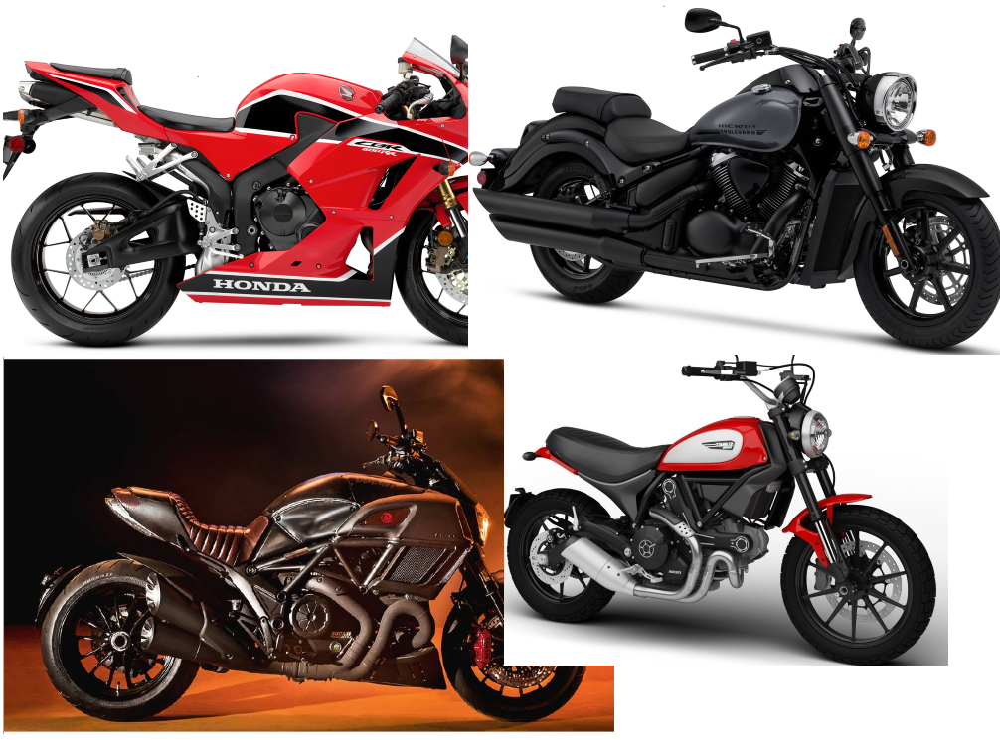

**My Data Journey with Motorcycle Classification **

Summary
=======

It always starts the same way. The forum post is accompanied by a photo
of some random motorcycle. What bike is this? Experts and novices alike
scramble to find the make, model and year of the motorcycle pictured.
Wouldn't it be nice to easily classify a motorcycle from an image? This
project seeks to do just that.

Using the power of pre-trained convolutional neural networks, we can
customize the models to classify the year, make and model of motorcycle
images. What kind of performance can we expect? Is it even possible?
Motorcycles can be very similar between various models and years. We
will find that we can routinely achieve around 70% top-3 accuracy with a
relatively small data set. We will also find that to increase accuracy,
we would likely need to greatly increase the size of the data set
collected in this project. Along the way, we will look at methods to
collect and process data, while building a suitable model for
classification.

In the end, we will find that model tuning, data transformation, and
data augmentation have, at best, incremental benefits on the model. In
fact, the best time I spent on this project involved performance tuning
Pytorch itself to achieve faster modeling times.

\*\* Please note. Only selected code examples are included in this
document. To see all code, look through the Jupyter notebooks and the
two python packages in the git repository. The notebooks are numbered in
order needed to run all of them. They have all ben saved with output.
This means you can see the code and results in the Github repository.

Data
====

I could not find any existing free data sets for image classification.
There were commercial options, but prices were not listed. In the end, I
decided to create my own data set. After a lot of experimentation, I
found that totalmotorcycle.com had a very consistent naming convention
for motorcycles and included just about every commercial motorcycle ever
made. This was a good start.

Obtaining Data (Notebooks 1 and 2)
----------------------------------

### Links

-   [Notebook
    1](https://github.com/leogodin217/motorcycle_classification/blob/master/code/1%20-%20First%20Motorcycle%20Data.ipynb):
    All code to obtain the first 700 images with 366 classes.

-   [Notebook
    2](https://github.com/leogodin217/motorcycle_classification/blob/master/code/2%20-%20Finding%20Motorcycle%20Data.ipynb):
    Code needed to obtain 2800 images across 366 classes. (Uses
    randomdatautilities.downloads from this repository).

With help from a Python package called google\_image\_download, I was
able to download about 700 images by searching for specific makes and
years. The below results are from a search on "2017 kawasaki". Notice
how we get multiple models and that the naming conventions are pretty
consistent. they include the year, make and model, with a few different
suffixes. I was able to create a few regular expressions to obtained
clean classes for each image. The first images results in a class of
"2017 kawasaki ninja 300". This first data set included 367 classes
across 700 images. Not a bad start, but it is unlikely that this small
number of images would be sufficient.

{width="6.5in" height="2.6993055555555556in"}

Figure . Image names fro topmotorcycle.com

{width="6.5in" height="1.6180555555555556in"}

Figure . Regular expressions to extract targets from image names.

While this data set was interesting, it was not big enough. I found that
Bing has a great image-search API. Using this API, I was able to
download 2800 images across all the classes. Through manual searches, I
found that capping the number of images per class to ten provided the
best results. Fewer than ten generally provided excellent images. More
than ten would often include other motorcycles or random parts from a
catalog. After running several tests, I worried about performance.

I did not want to lose a day waiting for images to download. To that
end, I learned about parallel processing in Python. I spent about three
hours getting everything working, started the downloads and took a
shower. When I came back, the downloads had completed. Looking back, I
probably cost myself time by spending three hours learning how to use
parallel processing. That being said, it is a valuable skill that will
certainly be useful in the future. With 2800 motorcycle images
downloaded, it was time to take a peak at what I got.

{width="6.5in" height="4.125694444444444in"}

Figure . Code used to turn totalmotorcycle.com images into searchable
targets.

{width="6.5in" height="2.975in"}

Figure . Code to download images across 16 threads on 8 cores.

Pre-processing 
---------------

### Links

-   [Notebook
    3](https://github.com/leogodin217/motorcycle_classification/blob/master/code/3-%20Data%20pre-processing.ipynb):
    All code to pre-process the data.

    Throughout this process, I often came back to notebook 3. This is
    where I created clean data sets, that fit various scenarios. First,
    I ensured there were at least three images per class, so we would
    have one image for training, validation and testing. Later on, I
    wanted to see what would happen if I made the images square, by
    padding the top and bottom. Near the end of the project, I wanted to
    test classes that had eight or more images, then seven or fewer.
    These results will appear later under Data Tuning.

    The most interesting code from this notebook segments images into
    train, validation and test. It allows us to easily segment images
    per class with a proportion dedicated to each. With that done, it
    was time for some exploratory data analysis.

    {width="6.5in" height="3.475in"}

Figure . Segmenting images to train, validation and test.

EDA
---

Links

-   [Notebook
    4](https://github.com/leogodin217/motorcycle_classification/blob/master/code/4%20-%20Image%20EDA.ipynb):
    All code to perform EDA.

    First up was figuring out how many images we had per class. While it
    varied greatly, as shown by the first image. The histogram showed
    that most classes had at least eight images.

    {width="6.5in" height="3.5833333333333335in"}

Figure . Images per class.

{width="6.5in" height="2.486111111111111in"}

Figure . Histogram of images per class.

{width="6.5in" height="6.159027777777778in"}

Figure . Classes with the least and most images.

It was easy to display and resize certain images using Python's PIL
library.

{width="6.5in" height="3.040277777777778in"}

Figure . Classes with the least and most images.

Figure . Histogram of images per class.

Figure . Images per class.

Data Tuning
===========

Transforms
----------

Balance
-------

Modeling
========

Model Selection
---------------

### Resnet-34

### Batchnorm vs. Dropout

Model tuning
------------

### Learning rate

### Batch Size

Further Research
================

Conclusion
==========
