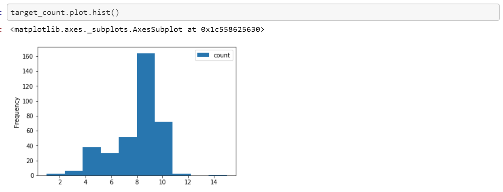
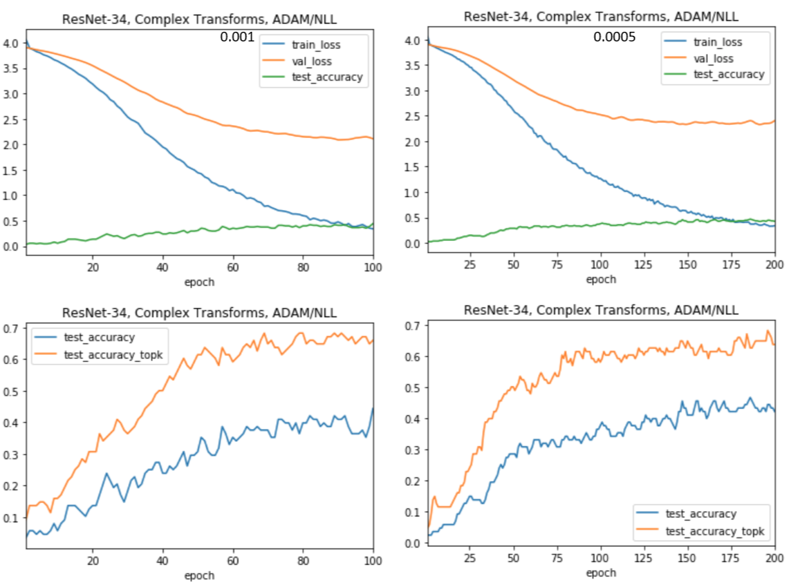

My Data Journey with Motorcycle Classification
===============================================

[Summary](#summary)

[Data](#data)

[EDA](#eda)

[Data Tuning](#data-tuning)

[Modeling](#modeling)

[Final Model](#final-model)

[Further Research](#further-research)

[Conclusion](#conclusion)

Summary
=======

It always starts the same way. The forum post is accompanied by a photo
of some random motorcycle. What bike is this? Experts and novices alike
scramble to find the make, model and year of the motorcycle pictured.
Wouldn't it be nice to easily classify a motorcycle from an image? This
project seeks to do just that.

Using the power of pre-trained convolutional neural networks, we can
customize the models to classify the year, make and model of motorcycle
images. What kind of performance can we expect? Is it even possible?
Motorcycles can be very similar between various models and years. We
will find that we can routinely achieve around 70% top-3 accuracy with a
relatively small data set. We will also find that to increase accuracy,
we would likely need to greatly increase the size of the data set
collected in this project. Along the way, we will look at methods to
collect and process data, while building a suitable model for
classification.

In the end, we will find that model tuning, data transformation, and
data augmentation have, at best, incremental benefits on the model. In
fact, the best time I spent on this project involved performance tuning
Pytorch itself to achieve faster modeling times.

Throughout the last eight weeks, I conducted myriad experiments. Not all
are included in this document or code repository. Most test results show
will test data with fifty targets over fifty epochs. Some will include
more epochs as needed. Data with fifty targets was the sweet spot
between a low number of targets with high accuracy and a high number of
targets with low accuracy.

\*\* Please note. Only selected code examples are included in this
document. To see all code, look through the Jupyter notebooks and the
two python packages in the git repository. The notebooks are numbered in
order needed to run all of them. They have all ben saved with output.
This means you can see the code and results in the Github repository.

\*\* Since I do not have license to publish the data I used, data is not
included in this repository. Though, the code to obtain data is. See
notebooks 1 and 2. Notebook 2 will require a Microsoft Azure account and
an API key for their cognitive services. As with any automated image
download, issues can occur. The most common was bad images and images
with long names. These are easily resolved and script output points to
the issues.

\*\* To run the Jupyter notebooks, a little setup is required. Libraries
are listed in each of the notebooks. I recommend using Anaconda and
creating a virtual environment. Utility functions and classes are
included in randomdatautilities and modeling. The can be installed with
pip -e.

Data
====

I could not find any existing free data sets for image classification.
There were commercial options, but prices were not listed. In the end, I
decided to create my own data set. After a lot of experimentation, I
found that totalmotorcycle.com had a very consistent naming convention
for motorcycles and included just about every commercial motorcycle ever
made. This was a good start.

Obtaining Data
--------------

### Links

-   [Notebook
    1](https://github.com/leogodin217/motorcycle_classification/blob/master/code/1%20-%20First%20Motorcycle%20Data.ipynb):
    All code to obtain the first 700 images with 366 classes.

-   [Notebook
    2](https://github.com/leogodin217/motorcycle_classification/blob/master/code/2%20-%20Finding%20Motorcycle%20Data.ipynb):
    Code needed to obtain 2800 images across 366 classes. (Uses
    randomdatautilities.downloads from this repository).

The initial data set consisted of 700 images across 366 classes. This was
simply too few images per class. To augment the initial data, I utilized
the Bing search API and finished with 2800 images.

For more information on the process of obtaining data, see
[Obtaining data](https://github.com/leogodin217/motorcycle_classification/blob/master/obtaining_data.md).

Pre-processing
---------------

### Links

-   [Notebook
    3](https://github.com/leogodin217/motorcycle_classification/blob/master/code/3-%20Data%20pre-processing.ipynb):
    All code to pre-process the data.

    Throughout this process, I often came back to notebook 3. This is
    where I created clean data sets, that fit various scenarios. First,
    I ensured there were at least three images per class, so we would
    have one image for training, validation and testing. Later on, I
    wanted to see what would happen if I made the images square, by
    padding the top and bottom. Near the end of the project, I wanted to
    test classes that had eight or more images, then seven or fewer.
    These results will appear later under Data Tuning.

    The most interesting code from this notebook segments images into
    train, validation and test. It allows us to easily segment images
    per class with a proportion dedicated to each. With that done, it
    was time for some exploratory data analysis.

    

Figure . Segmenting images to train, validation and test.

EDA
---

### Links

-   [Notebook
    4](https://github.com/leogodin217/motorcycle_classification/blob/master/code/4%20-%20Image%20EDA.ipynb):
    All code to perform EDA.

    First up was figuring out how many images we had per class. While it
    varied greatly, as shown by the first image. The histogram showed
    that most classes had at least eight images.

    

Figure . Images per class.

Figure . Histogram of images per class.

Figure . Classes with the least and most images.

It was easy to display and resize certain images using Python's PIL
library.

Figure 9. A resized Indian Motorcycle.

Data Tuning
===========

With a small number of images per class, data transformations are
critical to model performance. Also, balancing the data, can have
significant impacts. In order to efficiently test various
configurations, I created a Python package with constants and functions
for creating Pytorch data loaders. One of the more interesting features
is the TargetSampler. This allows us to create data loaders that will
return training, validation and testing data sets that all have the same
classes. It allows us to subset the data, without worrying about any
differences in classes.

Figure 10. Sampler to ensure subsets have the same classes.

Transforms
----------

### Links

-   [Notebook
    5](https://github.com/leogodin217/motorcycle_classification/blob/master/code/5%20-%20Transform%20Selection.ipynb):
    Code to test various data transforms. (Utilizes
    modelingfunctions.dataprocessing, modelingfunctions.modeling and
    modelingfunctions.utilities.)

I tested several different transforms. The most basic was a default
transform that simply resized and cropped the images. The more complex
transforms included data augmentation by performing random transforms
like color jitter and rotation. Data augmentation is common when data is
limited. Furthermore, I tried wider, smaller and larger transforms. Data augmentation
at 244x244 resolution provided the best results.

For more inforamtion on data transformations, see [data transformation](https://github.com/leogodin217/motorcycle_classification/blob/master/data_transforms.md).

-------------------------------------------------------------------

Figure 14. Complex transforms.

Balance
-------

### Links

-   [Notebook
    6](https://github.com/leogodin217/motorcycle_classification/blob/master/code/6%20-%20Testing%20Data%20Balance.ipynb):
    Code to test various data balances. (Utilizes
    modelingfunctions.dataprocessing, modelingfunctions.modeling and
    modelingfunctions.utilities.)

    I wanted to test how the model performs when only selecting classes
    with at least eight images and conversely, with fewer than eight. I
    found that the more images per class, the better the model
    performed.

    For more information on data balance, see [data balance](https://github.com/leogodin217/motorcycle_classification/blob/master/data_balance.md)

Modeling
========

Most of the experiments shown in this document utilize transfer learning
through ResNet-34. This model is a popular convolutional neural network
containing pre-trained weights. Early on, I created functions and code
that would build and train the network. It became burdensome to copy and
paste the code between notebooks, so I moved the code into a python
package. All results in this document utilize code from the package.

The most interesting code from this package replaces the final
fully-connected layer of ResNet with a custom layer used to classify
motorcycles. Here we see a combination of linear layers and Relu
functions. We also include batch normalization in the final model for
generalization. We will discuss that more in a future section.

Figure . Replaced fully-connected layer in ResNet.

Model Selection
---------------

One thing to note on all results is that they are stochastic. ResNet
with random data transformations is not a deterministic model. This
means we may run the exact same experiment twice and get different
results. Normally, we would seed the random generator, but I chose not
to. This allowed me to see how the results would vary. I tested various
optimization functions and ADAM optimization greatly outperformed
everything else. All results in this document use ADAM optimization.

### Resnet

### Links

-   [Notebook
    7](https://github.com/leogodin217/motorcycle_classification/blob/master/code/7%20-%20Model%20Selection.ipynb):
    Code to test various models. (Utilizes
    modelingfunctions.dataprocessing, modelingfunctions.modeling and
    modelingfunctions.utilities.)

ResNet is a complicated convolutional neural network that provides
world-class results for image recognition. It comes in several flavors,
each one more complicated. My testing showed the most promising results
from ResNet-34. This model provided better accuracy than the less
complicated models and better generalization than the more complicated
models.

Figure 17. ResNet-18 and ResNet-34

Figure 18. ResNet-101 and ResNet-152.

### Generalization

### Links

-   [Notebook
    8](https://github.com/leogodin217/motorcycle_classification/blob/master/code/8%20-%20Batchnorm%20vs%20Dropout.ipynb):
    Code to test various methods of generalization. (Utilizes
    modelingfunctions.dataprocessing, modelingfunctions.modeling and
    modelingfunctions.utilities.)

Generalization entails modifications to the model to ensure it does not
only fit the training data, but validation and test data as well. There
are three common methods used in convolutional neural networks, batch
normalization, dropout and none. Dropout randomly ignores some
proportion of the features. This provides generalization by only using a
random set of features during each epoch. While this is good for
generalization, it requires more epochs for training and often lowers
accuracy. Batch normalization takes a different approach.

Instead of ignoring features, it normalizes the output of one layer and
before passing it to the next layer. This ensures that during each
epoch, the model is using the same distribution between all layers. With
no generalization, we simply pass data as it is. My experiments showed
that batch normalization was probably the best. Just like in other
experiments, there was not a clear winner, but something that seemed to
generalize better, while still having room to improve with more
training. More importantly, batch normalization shows a steadily
decreasing validation loss.

Figure . Batch normalization vs. no generalization.

Figure . Droput 20% vs. 40%.

Model tuning
------------

Now we have a final model, including data transforms and normalization,
we need to tune the model. There are two hyperparameters that should be
tuned using ResNet-34 with ADAM optimization, learning rate and batch
size.

### Learning rate

### Links

-   [Notebook
    9](https://github.com/leogodin217/motorcycle_classification/blob/master/code/9%20-%20Learning%20rate.ipynb):
    Code to test various learning rates. (Utilizes
    modelingfunctions.dataprocessing, modelingfunctions.modeling and
    modelingfunctions.utilities.)

-   [Notebook
    10](https://github.com/leogodin217/motorcycle_classification/blob/master/code/10%20-%20Learning-rate%20decay.ipynb):
    Code to test learning rate decay. (Utilizes
    modelingfunctions.dataprocessing, modelingfunctions.modeling and
    modelingfunctions.utilities.)

Learning rate is the first hyperparameter to tune. I tested rates as
high as 0.003 and as low as 0.001. In general, I found that lower
learning rates had less various between epochs, but the effect was not
nearly as different as I expected. There is a lot of randomness from one
epoch to the next.

The image below shows the difference between lr=0.001 for 100 epochs and
lr=0.0005 for 200 epochs. Both have similar patterns. Though, 0.0005 has
slightly smaller peaks and valleys. I also tested learning rate decay.
It did not perform well. See notebook 10 for the results. Finally, I
tested lr=0.003 and let it run for 200 epochs. That provided promising
results. In the end, I decided to stick with lr=0.0005, as it should
provide the most consistent results, considering the variance we see
from epoch to epoch.

Figure . Learning rate 0.001 vs. 0.0005.

Figure . Learning rate 0.003.

### Batch Size

### Links

-   [Notebook 11](https://github.com/leogodin217/motorcycle_classification/blob/master/code/11%20-%20Testing%20Batch%20Size.ipynb): Code to test batch size. (Utilizes
    modelingfunctions.dataprocessing, modelingfunctions.modeling and
    modelingfunctions.utilities.)

    Throughout most of this work, I assumed batch size only impacted the
    physical performance of the model. Larger batch sizes would take
    less time to train than smaller batch sizes. I found out that the
    ADAM optimizer changes with batch size, as the gradients are
    calculated after each batch. Using a batch size of 64 worked best.
    128 did showed more variance after 75 epochs and 32 showed an
    increasing validation loss.

    

Figure . Batch size 128 vs. 64.

Figure . Batch size = 32.

Final Model
===========

Links

-   [Notebook
    12](https://github.com/leogodin217/motorcycle_classification/blob/master/code/12%20-%20Final%20Model.ipynb):
    : Code to run the final model. (Utilizes
    modelingfunctions.dataprocessing, modelingfunctions.modeling and
    modelingfunctions.utilities.)

    It has been a long journey, but we are not at the point where we can
    see the final model. This is a ResNet-34 model, using ADAM
    optimization and batch normalization. We use a batch size or 64 and
    a learning rate of 0.0005. Towards the end of 200 epochs, it
    consistently hits above 40% accuracy and above 70% top-3 accuracy.
    This is the best results from any model shown previously. Not bad.

    

Figure . The final model.

Further Research
================

I am not sure if further research is the correct term. While we found
many ways to impact our results, nothing was completely consistent. Some
of our sub-optimal models may provide a better result at epoch 200 than
our best model. There is just too much inconsistency. To improve this
model, much more data is needed. We have 366 classes and they mostly
only cover motorcycles made between 2016 and 2018. A comprehensive set
of classes would number in the thousands. Yet, we have proven that a
convolutional neural network can be trained to classify motorcycles. A
governmental or commercial application is likely plausible with more
data.

Conclusion
==========

Our goal was to classify images of motorcycles by year, make and model.
We utilized Pytorch transfer learning with a ResNet convolutional neural
network. Early attempts stalled below 40% accuracy. Through data
transformation, model building and model tuning, we consistently
achieved above 40%, with greater than 70% top-3 accuracy.

While these results are encouraging, they would likely greatly improve
with much more data. With so few images for so many classes, we needed
to utilize data augmentation. This augmentation created a large variance
in loss and accuracy from epoch to epoch. This created a situation where
stopping at 199 epochs might increase accuracy by up to 5% over stopping
at epoch 200.

This was a satisfying project. I learned a lot about convolutional
neural networks and PyTorch. As a bonus, I learned about parallel
programming and image manipulation in Python. Though, I will not likely
continue this project, I now have the skills to tackle other challenges.
