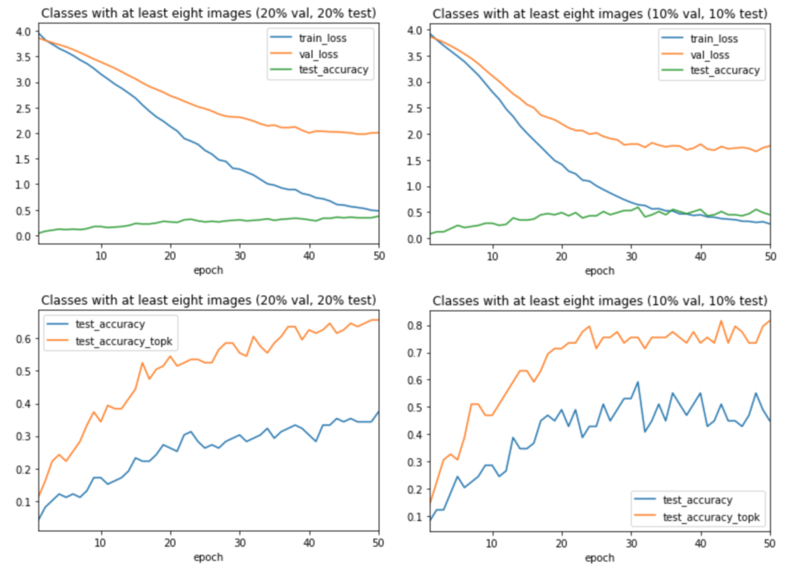

### Links

-   [Notebook
    6](https://github.com/leogodin217/motorcycle_classification/blob/master/code/6%20-%20Testing%20Data%20Balance.ipynb):
    Code to test various data balances. (Utilizes
    modelingfunctions.dataprocessing, modelingfunctions.modeling and
    modelingfunctions.utilities.)

    In one experiment, I used only 10% of the images for
    validation and 10% for testing. This model performed the best, but I
    was concerned that was too few images for validation and testing.
    Therefore, I decided to use only classes with at least eight images,
    using 20% for validation and testing. As expected, classes with
    fewer than eight images performed worse.

    

Figure 15. Classes with at least eight images.
