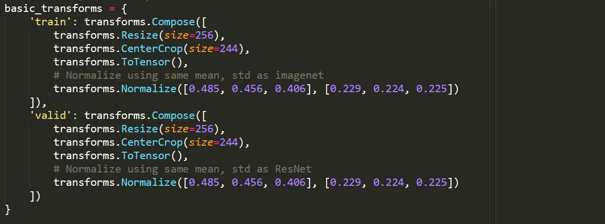

### Links

-   [Notebook
    5](https://github.com/leogodin217/motorcycle_classification/blob/master/code/5%20-%20Transform%20Selection.ipynb):
    Code to test various data transforms. (Utilizes
    modelingfunctions.dataprocessing, modelingfunctions.modeling and
    modelingfunctions.utilities.)

While there was no clear winner. The complex transforms, using the
default size, held the most promise. Even though they did not result in the
highest accuracy, the model had more room to grow and less difference between
training loss and validation loss. Others, that performed slightly
better after 50 epochs, saw a logarithmic pattern to accuracy, which
suggests they will not gain much from further training. All models
showed a strong divergence between training loss and validation loss.
This suggests the model may not generalize well.

Note that all complex transforms were only applied to training data.
Test and validation data utilized simple transforms.

Images showing results all include a single plot for training and
validation loss combined with test accuracy. A second plot shows the
test accuracy and top-3 accuracy. Notice how the basic data starts
strong but tails off after 35 epochs. The complex transforms vary more
but are generally increasing in accuracy. More results are included in
notebook 5.

Figure 11. Basic transforms.

Figure 12. Complex transforms.

Figure 13. Basic transforms.

