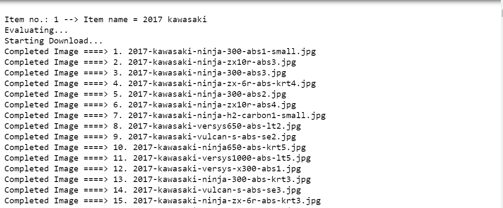
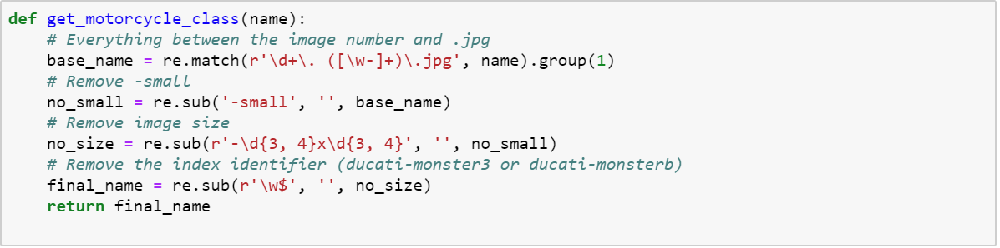

Obtaining Data
--------------

### Links

-   [Notebook
    1](https://github.com/leogodin217/motorcycle_classification/blob/master/code/1%20-%20First%20Motorcycle%20Data.ipynb):
    All code to obtain the first 700 images with 366 classes.

-   [Notebook
    2](https://github.com/leogodin217/motorcycle_classification/blob/master/code/2%20-%20Finding%20Motorcycle%20Data.ipynb):
    Code needed to obtain 2800 images across 366 classes. (Uses
    randomdatautilities.downloads from this repository).

With help from a Python package called google\_image\_download, I was
able to download about 700 images by searching for specific makes and
years. The below results are from a search on "2017 kawasaki". Notice
how we get multiple models and that the naming conventions are pretty
consistent. they include the year, make and model, with a few different
suffixes. I was able to create a few regular expressions to obtain
clean classes for each image. The first images results in a class of
"2017 kawasaki ninja 300". This first data set included 367 classes
across 700 images. Not a bad start, but it is unlikely that this small
number of images would be sufficient.

Figure . Image names fro topmotorcycle.com

Figure . Regular expressions to extract targets from image names.

While this data set was interesting, it was not big enough. I found that
Bing has a great image-search API. Using this API, I was able to
download 2800 images across all the classes. Through manual searches, I
found that capping the number of images per class to ten provided the
best results. Fewer than ten generally provided excellent images. More
than ten would often include other motorcycles or random parts from a
catalog. After running several tests, I worried about performance.

I did not want to lose a day waiting for images to download. To that
end, I learned about parallel processing in Python. I spent about three
hours getting everything working, started the downloads and took a
shower. When I came back, the downloads had completed. Looking back, I
probably cost myself time by spending three hours learning how to use
parallel processing. That being said, it is a valuable skill that will
certainly be useful in the future. With 2800 motorcycle images
downloaded, it was time to take a peak at what I got.

Figure . Code used to turn totalmotorcycle.com images into searchable
targets.

Figure . Code to download images across 16 threads on 8 cores.
